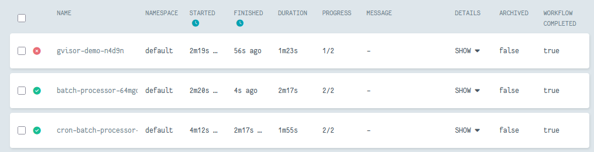

# Take Home Assignment

- [Take Home Assignment](#take-home-assignment)
  - [1. Introduction](#1-introduction)
    - [1.1. Results](#11-results)
  - [2. Setup](#2-setup)
    - [2.1. Installations](#21-installations)
      - [2.1.1. uv](#211-uv)
      - [2.1.2. Docker](#212-docker)
      - [2.1.3. Minikube](#213-minikube)
      - [2.1.4. kubectl](#214-kubectl)
      - [2.1.5. Argo CLI](#215-argo-cli)
      - [2.1.6. Testing Installations](#216-testing-installations)
    - [2.2. Setting up Scripts](#22-setting-up-scripts)
      - [2.2.1. fake\_gen](#221-fake_gen)
      - [2.2.2. aggregator](#222-aggregator)
    - [2.3. Setting up the Kubernetes Cluster](#23-setting-up-the-kubernetes-cluster)
      - [2.3.1. Setting up Minikube](#231-setting-up-minikube)
      - [2.3.2. Setting up Argo](#232-setting-up-argo)
      - [2.3.3. Setting up Argo Service Account](#233-setting-up-argo-service-account)
      - [2.3.4. Setting up PostgreSQL](#234-setting-up-postgresql)
  - [3. Running the Workflow](#3-running-the-workflow)
      - [3.1. Loading the built Docker images](#31-loading-the-built-docker-images)
      - [3.2. Submitting the Workflow](#32-submitting-the-workflow)
      - [3.3. Accessing the Argo UI](#33-accessing-the-argo-ui)
      - [3.4. Accessing the PostgreSQL Database](#34-accessing-the-postgresql-database)
  - [4. GVisor Demo](#4-gvisor-demo)
    - [4.1. Enabling gvisor](#41-enabling-gvisor)
    - [4.2. Running the gvisor Workflow](#42-running-the-gvisor-workflow)
    - [4.3. Results](#43-results)
      - [4.3.1. Logs of pod A (default runtime)](#431-logs-of-pod-a-default-runtime)
      - [4.3.2. Logs of pod B (gvisor runtime)](#432-logs-of-pod-b-gvisor-runtime)
      - [4.4. Explanation](#44-explanation)
  - [5. Notes](#5-notes)

---

## 1. Introduction
This repo is a solution to a take-home assignment. The details are described in the [assignment doc](./CBR%20Assignment.md).

### 1.1. Results
The worfklow was successfully run on a local Minikube cluster using Argo Workflows.
They are named as follows:
1. `batch-event-processor`: The single run workflow that generates fake events and aggregates them.
2. `cron-batch-processor`: The cron workflow that runs every 5 minutes and generates fake events and aggregates them.
3. `gvisor-demo`: The gvisor workflow that demonstrates the isolation provided by gvisor.

The results of the workflow can be seen in the following screenshots:



## 2. Setup

Tested on **Ubuntu Server 24.04 LTS**.

<details>
  <summary><b>TLDR:</b> Scripts to set up and run everything</summary>

  Handles the installations and setup of the cluster and workflow.
  - `prep.sh`: Installs the necessary packages.
  - `setup.sh`: Installs the cli for minikube, kubectl, and argo. 
  - `run.sh`: Sets up the minikube cluster, argo, postgres, builds and loads the docker images, and runs the workflow.

  ```sh
  # Clone the repo
  git clone https://github.com/ApoorvaKashyap/batch-event-processor.git && cd batch-event-processor

  # Grant Persmissions
  chmod +x ./*.sh

  # Run the scripts
  ./prep.sh
  ./setup.sh
  ./run.sh
  ```

</details>

### 2.1. Installations

#### 2.1.1. uv

_uv_ is a Python package and project manager.

It can be installed using the following command ([Documentation](https://docs.astral.sh/uv/getting-started/installation/#__tabbed_1_1)):

```sh
curl -LsSf https://astral.sh/uv/install.sh | sh
```

#### 2.1.2. Docker

Install the _docker.io_ and related packages from Ubuntu repos.

```sh
sudo apt install containerd docker.io docker-buildx
```

Add your user to the `docker` group or run the docker commands with `sudo`.

```sh
sudo usermod -aG docker $USER && newgrp docker
```

Start the docker service and schedule it for reboots.

```sh
sudo systemctl enable --now docker
```

#### 2.1.3. Minikube

Install the minikube binaries ([Documentation](https://minikube.sigs.k8s.io/docs/start/?arch=%2Flinux%2Fx86-64%2Fstable%2Fbinary+download)):

```sh
curl -LO "https://github.com/kubernetes/minikube/releases/latest/download/minikube-linux-amd64"
sudo install minikube-linux-amd64 /usr/local/bin/minikube && rm minikube-linux-amd64
```

#### 2.1.4. kubectl

Install the kubectl executable ([Documentation](https://kubernetes.io/docs/tasks/tools/install-kubectl-linux/)):

```sh
curl -LO "https://dl.k8s.io/release/$(curl -L -s https://dl.k8s.io/release/stable.txt)/bin/linux/amd64/kubectl"
sudo install -o root -g root -m 0755 kubectl /usr/local/bin/kubectl && rm ./kubectl
```

Check the documentation linked above if any issues arise.

#### 2.1.5. Argo CLI

Install the _Argo CLI_ for submitting argo workflows ([Documentation](https://github.com/argoproj/argo-workflows/releases/)).

```sh
# Detect OS
ARGO_OS="darwin"
if [[ "$(uname -s)" != "Darwin" ]]; then
  ARGO_OS="linux"
fi

# Download the binary
curl -sLO "https://github.com/argoproj/argo-workflows/releases/download/v3.7.1/argo-$ARGO_OS-amd64.gz"

# Unzip
gunzip "argo-$ARGO_OS-amd64.gz"

# Make binary executable
chmod +x "argo-$ARGO_OS-amd64"

# Move binary to path
mv "./argo-$ARGO_OS-amd64" /usr/local/bin/argo
```

#### 2.1.6. Testing Installations

Check if the installed programs are working as expected by checking their versions:

```sh
# uv
uv --version

# Docker
docker version

# Minikube
minikube version

# kubectl
kubectl version --client

# Argo Workflow CLI
argo version
```

### 2.2. Setting up Scripts

There are two scripts in the workflow:

1. **fake_gen**: Generates the fake events and stores them in a _events.jsonl_ file that is stored on a shared volume.
2. **aggregator**: Reads the _events.jsonl_ file and calculation the total session duration per user and saves it in a postgres database.

Before beginning, clone the repo using _git clone_:

```sh
git clone https://github.com/ApoorvaKashyap/batch-event-processor.git && cd batch-event-processor
```

Follow the steps below or alternatively run `run.sh` included in the repo.

#### 2.2.1. fake_gen

Run the following commands to generate a docker image for _fake_gen_:

```sh
docker build -t fake_gen:latest -f ./fake_gen/Dockerfile ./fake_gen/
```

#### 2.2.2. aggregator

Run the following commands to generate a docker image for _aggregator_:

```sh
docker build -t aggregator:latest -f ./aggregator/Dockerfile ./aggregator/
```

### 2.3. Setting up the Kubernetes Cluster

#### 2.3.1. Setting up Minikube

Start the Minikube cluster with the following command:

```sh
minikube start --addons gvisor --container-runtime=containerd --docker-opt containerd=/var/run/containerd/containerd.sock
```

#### 2.3.2. Setting up Argo

Create the argo namespace.

```sh
kubectl create namespace argo
```

Install Argo Workflows using the Quick Start manifest:

```sh
export ARGO_WORKFLOWS_VERSION="v3.7.1" # Set the desired version of Argo Workflows
kubectl apply -n argo -f "https://github.com/argoproj/argo-workflows/releases/download/${ARGO_WORKFLOWS_VERSION}/quick-start-minimal.yaml"
```

#### 2.3.3. Setting up Argo Service Account

Set up argo service account so that the workflows can access the default namespace.

```sh
kubectl create serviceaccount argo-workflow -n default
kubectl create rolebinding argo-workflow-rb --clusterrole=admin --serviceaccount=default:argo-workflow -n default
```

#### 2.3.4. Setting up PostgreSQL

The manifest for the postgres deployment is located in the `k8_manifests/postgres/postgres17.yaml` file.

Apply the PostgreSQL manifest to deploy a PostgreSQL instance:

```sh
kubectl apply -f k8_manifests/postgres/postgres17.yaml
```

## 3. Running the Workflow

#### 3.1. Loading the built Docker images

To load the Docker images into the Minikube cluster, run the following commands:

```sh
minikube image load fake_gen:latest
minikube image load aggregator:latest
```

#### 3.2. Submitting the Workflow

To run the workflow, you can use the `argo` CLI to submit the workflow manifest located in `argo_workflows/single_run.yaml`.

```sh
argo submit -n default --watch argo_workflows/single_run.yaml
```

To run the cron workflow, you can similarly execute the following command:

```sh
argo cron create argo_workflows/cron_run.yaml
```

#### 3.3. Accessing the Argo UI

To access the Argo UI, you can use the following command to start a port-forwarding session:

```sh
kubectl port-forward -n argo svc/argo-server 2746:2746 &
```

Then, open your web browser and navigate to `https://localhost:2746` to access the Argo UI.

The workflow and the cron workflow can be monitored from the UI.

#### 3.4. Accessing the PostgreSQL Database

To access the PostgreSQL database, you can use the following command to start a port-forwarding session:

```sh
kubectl port-forward svc/postgres 5432:5432 &
```

Then, you can connect to the PostgreSQL database using a PostgreSQL client (like `psql` or a GUI tool) with the following connection details:
- Host: `localhost`
- Port: `5432`
- Database: `database`
- User: `user`
- Password: `password`

## 4. GVisor Demo

### 4.1. Enabling gvisor

Run the following command to enable gvisor for the Minikube cluster:

```sh
minikube addons enable gvisor
```

### 4.2. Running the gvisor Workflow
To run the gvisor workflow, you can use the `argo` CLI to submit the workflow manifest located in `argo_workflows/gvisor_run.yaml`.

```sh
argo submit -n default --watch argo_workflows/gvisor_run.yaml
```

### 4.3. Results
In the workflow, the `pod A` uses the default runtime, while `pod B` uses the gvisor runtime.

`pod A` was able to write to `/host` directory, while `pod B` failed to do so, demonstrating the isolation provided by gvisor.

This is evident from the logs of both pods.

#### 4.3.1. Logs of pod A (default runtime)
```sh
=== Security Isolation Test - Default Runtime ===
User: nobody
UID: 65534
=== Writing to Host Filesystem Test ===
Attempting to write to host filesystem at /host...
Test file path: /host/default-runtime.txt
/host/default-runtime.txt
✅ SUCCESS: File creation succeeded
File contents:
Security test from default runtime at Mon Aug 25 21:32:59 UTC 2025
=== Test completed for default runtime ===
time="2025-08-26T03:02:59 GMT+5:30" level=info msg="sub-process exited" argo=true error="<nil>"
```

#### 4.3.2. Logs of pod B (gvisor runtime)
```sh
=== Security Isolation Test - gVisor Runtime ===
User: nobody
UID: 65534
=== gVisor Runtime Analysis ===
Checking if running under gVisor sandbox...
Kernel version:
Linux version 4.4.0 #1 SMP Sun Jan 10 15:06:54 PST 2016
=== Writing to Host Filesystem Test ===
Attempting to write to host filesystem at /host...
Test file path: /host/gvisor-runtime.txt
❌ FAILED: Cannot write to host filesystem
Error details:
touch: cannot touch '/host/gvisor-runtime.txt': Permission denied
Permission denied or operation not permitted
time="2025-08-26T03:03:06 GMT+5:30" level=info msg="sub-process exited" argo=true error="<nil>"
Error: exit status 1
```

#### 4.4. Explanation

The write failure to `\host` occurs because the container is running under gVisor, a user-space kernel that intercepts and handles syscalls from the application instead of passing them directly to the host kernel. This provides strong isolation but also means certain operations, like writing to host-mounted paths, are restricted. In this case, the syscall to write to `\host` is intercepted and denied, producing a “Permission denied” error.

Under the default runtime with a HostPath volume, the same operation usually succeeds, since the kubelet-created directory is group-writable and allows non-root UIDs to write. With `runtimeClassName: gvisor`, however, **runsc** enforces gVisor’s stricter sandboxing and filesystem mediation, so the behavior differs even with identical volumes, users, and permissions.

Internally, gVisor uses two key components here:
- `gopher`: the Go-based user-space kernel that intercepts and emulates syscalls, implementing isolation by denying or mediating direct host access.
- `directfs`: a gVisor filesystem implementation that proxies filesystem operations. For host mounts, directfs strictly controls access to ensure the container cannot escape isolation, which is why the write attempt fails.

Thus, the observed difference between the control and gVisor steps stems not from Kubernetes volume configuration or permissions, but from gVisor’s syscall interception and filesystem mediation via gopher and directfs.

## 5. Notes
- The scripts `prep.sh`, `setup.sh`, and `run.sh` can be used to automate the setup and running of the workflow.
- If there is an issue with `ImagePullBackOff`, check the `DNS` settings of the host machine.
- The deployments may take some time. Wait a little bit before running the argo workflows. The `run.sh` script includes waiting commands to handle this.
- Please start the port forwards before accessing the Argo UI and PostgreSQL database.
